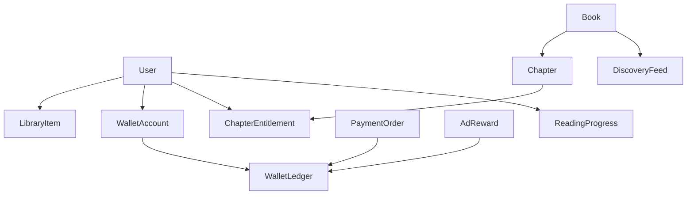

# App 架构分配与优化

> 依据：`docs/research/APK深度架构映射.md`。
> 目标：把竞品模块转化为我们自己的客户端、后端、CMS、增长、数据、合规架构。

## 1. 架构总原则

- 先跑通 GoodNovel 已验证的出海网文闭环：发现 → 详情 → 阅读 → 解锁 → 充值/钱包 → 推送召回 → 数据归因。
- 借鉴 iReader 的阅读器体验，不复制 iReader 的国内技术生态。
- MVP 采用模块化单体，不上复杂微服务。
- 客户端按业务域分包，而不是按页面随意堆文件。
- 所有增长、变现和推荐能力都必须有事件埋点，不做“不可度量”的功能。

## 2. 客户端架构（Flutter 推荐）

### 2.1 Feature-first 目录

```text
lib/
├─ app/                    # AppShell、路由、全局导航、主题、i18n
├─ core/                   # 网络、存储、错误、日志、配置、权限、SDK facade
├─ features/
│  ├─ discover/            # 书城、推荐流、分类、榜单、搜索
│  ├─ book/                # 书籍详情、章节列表、书评、相似推荐
│  ├─ reader/              # 阅读器、目录、进度、主题、缓存、书签
│  ├─ wallet/              # 钱包、充值、流水、奖励、广告解锁
│  ├─ account/             # 登录、个人中心、语言、隐私、注销
│  ├─ growth/              # 推送、站内信、活动、签到
│  └─ analytics/           # 事件定义、埋点上报、实验参数
└─ shared/                 # 通用组件、模型、工具
```

### 2.2 客户端模块边界

| 模块 | 职责 | 不负责 |
|---|---|---|
| `app` | 根路由、Tab、全局主题、登录态壳 | 业务逻辑 |
| `discover` | 推荐流、分类、榜单、搜索结果 | 解锁与支付 |
| `book` | 详情、章节、评论入口、相似推荐 | 正文排版 |
| `reader` | 正文渲染、目录、进度、主题、离线缓存 | 价格计算 |
| `wallet` | 余额、充值包、流水、奖励广告入口 | 服务端账务判定 |
| `account` | 登录、语言、隐私、通知设置、注销 | 内容推荐 |
| `growth` | Push Token、站内信、签到、活动 | 支付与解锁 |
| `analytics` | 事件标准、SDK facade、实验参数 | UI 状态管理 |

## 3. 后端模块化单体

```text
server/
├─ identity       # 用户、游客、三方登录、账号注销
├─ content        # 书、作者、章节、分类、标签、上下架
├─ discovery      # 首页运营位、榜单、推荐流、搜索索引
├─ reader         # 阅读进度、书架、已读位置、书签
├─ entitlement    # 免费章、已解锁章、等待解锁、广告解锁资格
├─ wallet         # 余额、流水、奖励币、消费账
├─ payment        # Google Billing/App Store IAP 回调与验单
├─ ads            # 激励广告回调、防作弊、奖励发放
├─ growth         # FCM、站内信、签到、活动配置
├─ analytics      # 事件接收、漏斗、实验参数
└─ admin          # CMS 后台接口
```

### 3.1 核心数据关系



## 4. SDK 接入顺序

| 阶段 | SDK/能力 | 目的 |
|---|---|---|
| 开发早期 | Firebase Crashlytics / Analytics | 稳定性和基础事件 |
| 付费闭环 | Google Play Billing / App Store IAP | 数字内容内购 |
| 召回闭环 | FCM / APNs | 新章、等待解锁、活动提醒 |
| 广告闭环 | AppLovin MAX + AdMob/Unity/ironSource | 激励广告解锁与赚币 |
| 买量前 | AppsFlyer 或 Adjust | 投放归因和 ROI |
| 欧洲上线前 | CMP / Google UMP | GDPR/广告同意管理 |
| 增长阶段 | AB 实验/远程配置 | 价格、广告频次、等待时长实验 |

## 5. 页面与模块分配

| 页面/功能 | 客户端模块 | 后端模块 | MVP |
|---|---|---|---|
| Discover 推荐流 | `discover` | `discovery` | 是 |
| 分类/榜单 | `discover` | `discovery` | 是 |
| 搜索结果 | `discover` | `discovery` + `content` | 是 |
| 书籍详情 | `book` | `content` + `discovery` | 是 |
| 章节目录 | `reader`/`book` | `content` + `entitlement` | 是 |
| 阅读器 | `reader` | `reader` + `content` | 是 |
| 付费墙 | `wallet` + `reader` | `entitlement` + `wallet` | 是 |
| 充值 | `wallet` | `payment` + `wallet` | 是 |
| 激励广告 | `wallet` | `ads` + `wallet` | 是 |
| 等待解锁 | `wallet`/`reader` | `entitlement` + `growth` | 是 |
| Library | `reader`/`book` | `reader` | 是 |
| Me/Settings | `account` | `identity` | 是 |
| 消息中心 | `growth` | `growth` | Should |
| 书评 | `book` | `content` | Should/Could |
| 社区 | `growth`/`community` | 新模块 | Won't |
| 作者中心 | `creator` | 新模块 | Won't |

## 6. 事件埋点分配

MVP 事件必须覆盖以下漏斗：

```text
app_open
onboarding_complete
discover_impression
book_click
book_detail_view
chapter_start
paywall_view
unlock_click
reward_ad_start
reward_ad_complete
purchase_start
purchase_success
wait_unlock_start
push_received
push_open
chapter_complete
```

## 7. 合规与权限基线

Android MVP 只申请：

- `INTERNET`
- `ACCESS_NETWORK_STATE`
- `POST_NOTIFICATIONS`（Android 13+）
- Google Billing / AD_ID（按 SDK 需要并配合同意管理）

不申请：

- 全盘存储、悬浮窗、应用内安装 APK、日历读写、自启动、读取任务栈、修改系统设置。

## 8. 当前 Web 原型优化方向

当前 `prototypes/v0-lofi/` 应继续作为信息架构原型，而不是最终生产架构。需补齐与竞品映射一致的入口：

- 搜索结果页（Discover）
- 章节目录页（Reader）
- 消息/通知页（Growth）
- 语言页、推送管理页、隐私页（Account/Compliance）
- 书评/评分入口（Book）

这些入口的目标是验证导航和业务闭环，不需要在 Web 原型里实现完整数据层。

