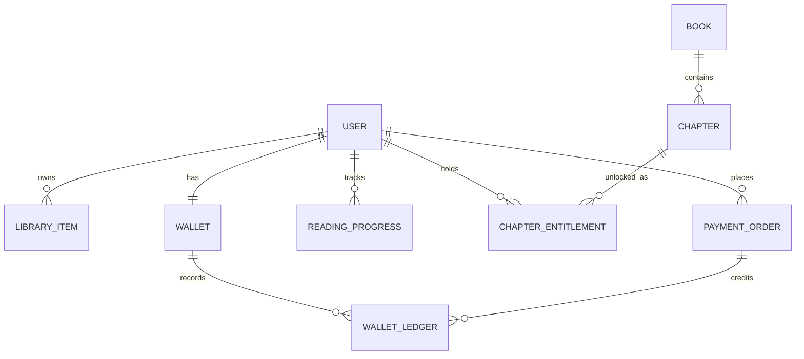
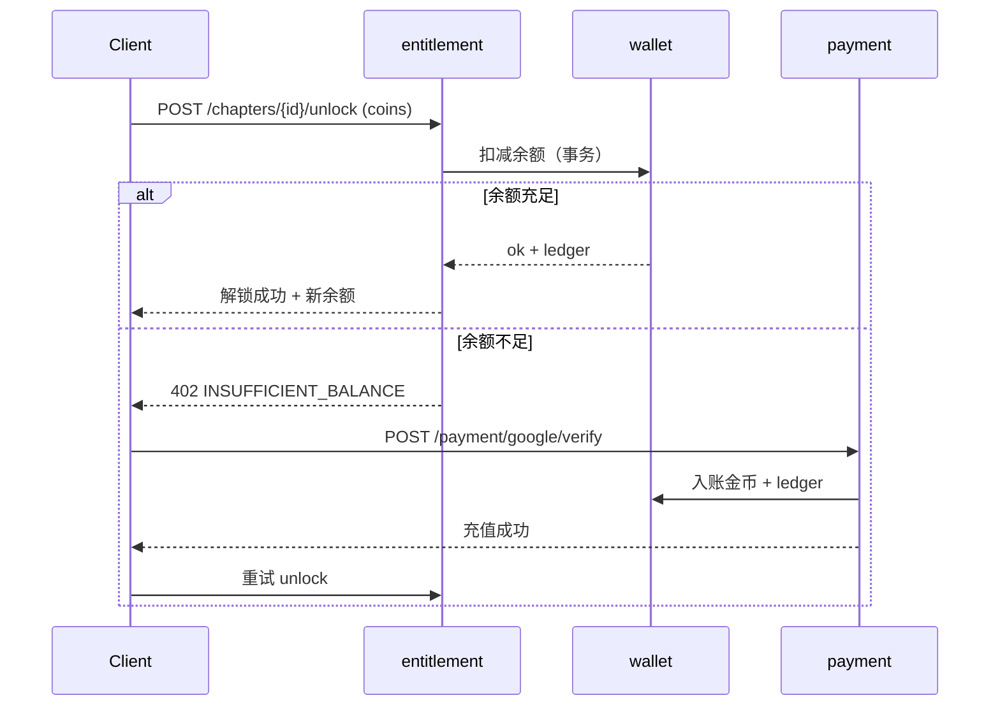

# 后端 API 与数据模型

> 依据：`docs/plan/App架构分配与优化.md` 的后端模块边界、`变现模型.md` 的解锁与钱包机制。
> 目的：把模块边界细化为可实现的接口契约与表结构，覆盖 MVP 主链路。范围限定 MVP（Must）。

## 1. 通用约定

- 风格：REST + JSON，`/api/v1` 前缀。
- 鉴权：登录后下发 JWT，`Authorization: Bearer <token>`；游客也发短期匿名 token。
- 时间：ISO 8601 UTC。金额/金币：整数（金币为整数，货币金额以最小单位分计）。
- 分页：`?page=&size=`，响应含 `{ items, page, size, total }`。
- 错误：HTTP 状态码 + `{ code, message }`，业务错误用稳定 `code`（如 `INSUFFICIENT_BALANCE`）。
- 幂等：解锁、支付回调、广告发奖等写操作支持 `Idempotency-Key`。

## 2. 模块与接口

### 2.1 identity（账号）

| 方法 | 路径 | 说明 |
|---|---|---|
| POST | `/auth/guest` | 创建游客身份，返回匿名 token |
| POST | `/auth/email/register` | 邮箱注册 |
| POST | `/auth/email/login` | 邮箱登录 |
| POST | `/auth/oauth` | Google/Facebook 登录（body: `provider`, `id_token`） |
| POST | `/auth/upgrade` | 游客绑定为正式账号（合并数据） |
| GET | `/me` | 获取当前用户资料 |
| PATCH | `/me` | 更新昵称/头像/简介(bio)/语言 |
| POST | `/me/delete` | 发起账号注销（合规要求） |
| POST | `/me/data-export` | 发起个人数据导出（GDPR，前台「Privacy & data → Request my data」） |
| GET | `/me/preferences` | 读取偏好（题材标签 + 推送偏好 + 隐私偏好） |
| PUT | `/me/preferences` | 写入偏好（引导页题材选择 / 推送管理开关 / 隐私开关） |

### 2.2 content + discovery（内容与发现）

| 方法 | 路径 | 说明 |
|---|---|---|
| GET | `/home` | 首页运营位 + 模块化 feed |
| GET | `/genres` | 分类列表 |
| GET | `/genres/{id}/books` | 分类下书籍 |
| GET | `/ranks/{type}` | 榜单（hot/new/finished） |
| GET | `/search?q=` | 搜索书籍 |
| GET | `/books/{id}` | 书籍详情 |
| GET | `/books/{id}/chapters` | 章节列表（含锁状态） |
| GET | `/books/{id}/recommend` | 相似推荐 |

### 2.3 reader（阅读）

| 方法 | 路径 | 说明 |
|---|---|---|
| GET | `/chapters/{id}/content` | 获取章节正文（需通过 entitlement 校验） |
| GET | `/me/library` | 我的书架/收藏（前台书架 Favorites tab、阅读器收藏按钮） |
| POST | `/me/library` | 加入书架（body: `book_id`）；阅读器底部「Library」按钮 |
| DELETE | `/me/library/{book_id}` | 移出书架（收藏取消） |
| GET | `/me/progress/{book_id}` | 读取阅读进度 |
| PUT | `/me/progress/{book_id}` | 上报/同步阅读进度 |
| GET | `/me/history` | 阅读历史（前台「我的 → Reading history」，按最近阅读排序） |

### 2.4 entitlement（解锁权益）

| 方法 | 路径 | 说明 |
|---|---|---|
| GET | `/books/{id}/entitlements` | 该书已解锁章节与免费章范围 |
| POST | `/chapters/{id}/unlock` | 解锁章节，body: `method`（coins/ad/wait），幂等 |
| POST | `/chapters/{id}/wait-unlock` | 启动等待解锁，返回 `ready_at` |
| GET | `/me/wait-unlocks` | 进行中的等待解锁列表 |

> 解锁判定在后端完成，客户端不可自行判定"已解锁"。`unlock` 返回最新余额与权益。
> 解锁通道规则：会员有效则全场畅读；非会员可通过金币、广告、等待三种方式获得单章 `chapter_entitlement`。书籍不再区分金币书/VIP 书。

### 2.5 wallet + payment + ads（钱包/支付/广告）

| 方法 | 路径 | 说明 |
|---|---|---|
| GET | `/me/wallet` | 余额（coins + bonus） |
| GET | `/me/wallet/ledger` | 金币流水分页（前台 Transactions 页） |
| GET | `/me/orders` | 真实货币订单分页（前台 Purchase history 页，含订阅与金币包） |
| GET | `/recharge/packages` | 充值档位（本地化定价） |
| POST | `/payment/google/verify` | Google Billing 验单回调，幂等，发币入账 |
| POST | `/ads/reward` | 激励广告完成校验后发奖，幂等（仅钱包 Watch & earn；付费墙不做广告解锁） |
| GET | `/me/checkin` | 签到状态（本周日历 + streak + 今日是否已签，前台签到页渲染依据） |
| POST | `/me/checkin` | 每日签到领币（服务端校时 + 幂等防重复领取） |

### 2.6 membership（会员订阅）

> 前台已按 V2 改为订阅优先：会员全场畅读、零广告、离线整本、徽章；金币仅为非会员按章购买出口。

| 方法 | 路径 | 说明 |
|---|---|---|
| GET | `/membership/plans` | 套餐列表（本地化定价 + intro offer + 展示权益） |
| POST | `/membership/google/verify` | 订阅验单（subscription purchase_token），幂等 |
| GET | `/me/membership` | 当前会员状态（plan / expires_at / auto_renew），阅读器与钱包卡片依据 |
| POST | `/membership/rtdn` | Google RTDN Webhook：续期/到期/退订/退款事件 |

> 会员是否生效的判定在后端：阅读器请求 `/chapters/{id}/content` 时按「免费章 / chapter_entitlement / 有效会员」三条路径放行，与前台 `_canRead` 逻辑一一对应。会员端隐藏广告与金币购买入口。

### 2.7 growth（增长）

| 方法 | 路径 | 说明 |
|---|---|---|
| POST | `/me/push-token` | 上报 FCM token |
| GET | `/me/messages` | 站内信列表（前台 Messages 页） |
| GET | `/me/messages/unread-count` | 未读数（「我的」页角标） |
| PATCH | `/me/messages/{id}` | 标记已读 |

## 3. 核心数据模型

### 表定义（MVP 字段）

**user**
| 字段 | 类型 | 说明 |
|---|---|---|
| id | uuid | 主键 |
| type | enum | guest / registered |
| email | string? | 注册邮箱 |
| oauth_provider | enum? | google/facebook |
| nickname / avatar_url | string | 资料 |
| locale | string | 语言偏好 |
| created_at / deleted_at | timestamp | 注销软删除 |

**book**
| 字段 | 类型 | 说明 |
|---|---|---|
| id | uuid | 主键 |
| title / author / cover_url / intro | - | 基本信息 |
| genre / tags | - | 品类与标签 |
| status | enum | ongoing / finished |
| age_rating | enum | general / mature（合规分级） |
| free_chapter_count | int | 免费章数 |
| chapter_price | int | 非会员单章金币价格；会员有效时全场畅读，不看章价 |
| stats | json | 评分/阅读数等 |

**chapter**
| 字段 | 类型 | 说明 |
|---|---|---|
| id | uuid | 主键 |
| book_id | uuid | 外键 |
| index | int | 章序 |
| title | string | 标题 |
| content_ref | string | 正文存储引用 |
| price_coins | int | 解锁价格（默认继承 `book.chapter_price`，0 = 免费章） |

**chapter_entitlement**
| 字段 | 类型 | 说明 |
|---|---|---|
| id | uuid | 主键 |
| user_id / chapter_id | uuid | 唯一组合 |
| method | enum | coins / ad / wait |
| created_at | timestamp | 解锁时间 |

**wallet / wallet_ledger**
| 字段 | 类型 | 说明 |
|---|---|---|
| wallet.user_id | uuid | 主键 |
| wallet.coins / bonus | int | 充值币 / 奖励币 |
| ledger.id | uuid | 流水主键 |
| ledger.type | enum | recharge/unlock/reward/checkin/refund |
| ledger.amount | int | 正为入账，负为支出 |
| ledger.ref_id | string | 关联订单/章节/广告 |
| ledger.balance_after | int | 入账后余额（对账用） |

**payment_order**
| 字段 | 类型 | 说明 |
|---|---|---|
| id | uuid | 主键 |
| user_id | uuid | 下单用户 |
| sku / price / currency | - | 商品与本地化价格 |
| coins / bonus | int | 到账金币 |
| provider | enum | google / apple |
| provider_token | string | 验单凭据 |
| status | enum | pending/paid/failed/refunded |
| is_first_purchase | bool | 首充标记 |

**reading_progress**
| 字段 | 类型 | 说明 |
|---|---|---|
| user_id / book_id | uuid | 唯一组合 |
| chapter_id / offset | - | 续读定位 |
| updated_at | timestamp | 同步时间（兼作阅读历史排序键） |

**subscription（会员）**
| 字段 | 类型 | 说明 |
|---|---|---|
| id | uuid | 主键 |
| user_id | uuid | 外键 |
| plan | enum | weekly / monthly / yearly |
| provider | enum | google / apple |
| purchase_token | string | 验单与 RTDN 关联凭据 |
| status | enum | active / grace / expired / revoked |
| expires_at | timestamp | 到期时间（前台到期日显示来源） |
| auto_renew | bool | 是否自动续期 |
| intro_offer | json? | 首月优惠、地区价格等展示信息 |

**checkin_log（签到）**
| 字段 | 类型 | 说明 |
|---|---|---|
| user_id + date | 唯一组合 | 服务端日期，防重复领取 |
| coins | int | 当日奖励 |
| streak | int | 连续天数（决定第 4/7 天加码奖励） |

**user_preference（偏好，JSON 列或独立表）**
| 字段 | 类型 | 说明 |
|---|---|---|
| user_id | uuid | 主键 |
| taste_tags | string[] | 引导页题材选择（推荐排序输入） |
| push_prefs | json | 推送总开关 + 分类开关 + 免打扰时段（推送分群过滤依据） |
| privacy_prefs | json | 个性化推荐 / 分析 / 广告追踪 同意状态（CMP 联动） |

**wait_unlock（等待解锁）**
| 字段 | 类型 | 说明 |
|---|---|---|
| user_id / chapter_id | uuid | 唯一组合 |
| started_at / ready_at | timestamp | 服务端计时，客户端不可篡改 |
| status | enum | pending / ready / claimed |

## 4. 关键流程（解锁 + 充值）

## 5. 前台 ↔ 后端数据闭环映射

> 原则：前台每个会改变状态的交互，都必须有对应接口与表承接；前台展示的每个数字，都能从后端查询还原。当前 Flutter 原型的 Riverpod 状态即未来接口的本地缓存层。

| 前台页面 / 交互 | Riverpod 状态（现状） | 后端接口 | 落库 |
|---|---|---|---|
| 付费墙「Read free with VIP」主按钮（所有付费章节展示） | `membershipProvider`（到期日） | `POST /membership/google/verify` | `subscription` |
| VIP 触发锁章 | `membershipProvider.isActive` | `GET /chapters/{id}/content` 直接放行；前台提示 `You're already VIP. Full book unlocked.` | — |
| 付费墙金币入口（Other ways to continue，非会员次级出口） | `coinsProvider` + `unlockedChaptersProvider` | 余额足够：`POST /chapters/{id}/unlock (coins)`；余额不足：先进入 `POST /payment/google/verify` 入账，再重试 unlock | `chapter_entitlement` + `wallet_ledger` |
| 阅读器章节放行判定（单通道） | `_canRead`: 免费章 + 会员全场畅读 + 已购章 | `GET /chapters/{id}/content` 放行规则：免费章一律放行；`subscription` 有效放行；`chapter_entitlement` 已购放行 | — |
| 阅读器收藏按钮 / 书架 Favorites | `favoritesProvider` | `POST/DELETE /me/library` | `library_item` |
| 阅读器翻章 / 进度条 | 本地章节状态 | `PUT /me/progress/{book_id}` | `reading_progress` |
| 金币充值 Sheet | `coinsProvider.add` | `POST /payment/google/verify` | `payment_order` + `wallet_ledger` |
| 每日签到（含 streak 加码） | `coinsProvider.add` + 页面本地状态 | `GET/POST /me/checkin` | `checkin_log` + `wallet_ledger` |
| 钱包 Watch & earn | `coinsProvider.add(12)` | `POST /ads/reward` | `wallet_ledger`（type=reward） |
| 钱包余额 / 「约 N 章」换算 | `coinsProvider` | `GET /me/wallet` | `wallet` |
| Transactions 页 | mock 列表 | `GET /me/wallet/ledger` | `wallet_ledger` |
| Purchase history 页 | mock 列表 | `GET /me/orders` | `payment_order` + `subscription` |
| 引导页题材选择 → 推荐排序 | `preferencesProvider` | `PUT /me/preferences` | `user_preference.taste_tags` |
| 推送管理页开关 | 页面本地状态 | `PUT /me/preferences` | `user_preference.push_prefs` |
| 隐私页开关 / 数据导出 / 清缓存 | 页面本地状态 | `PUT /me/preferences`、`POST /me/data-export` | `user_preference.privacy_prefs` |
| 编辑资料（昵称/Bio/头像） | mock | `PATCH /me` | `user` |
| 语言切换（19 种语言） | `localeProvider` | `PATCH /me`（locale 字段） | `user.locale` |
| 消息中心 + 角标 | mock 列表 | `GET /me/messages` + `unread-count` | `message` 表（growth 模块） |
| 阅读历史页 | mock（kLibraryBooks） | `GET /me/history` | `reading_progress` 排序视图 |
| 删除账号 | UI 占位 | `POST /me/delete` | `user.deleted_at` + 异步清理任务 |

## 6. MVP 不含（与路线图一致）

社区/评论、作者 UGC、漫画/有声、批量订购、Gems 二级货币相关接口与表，均在 MVP 之后再设计。

> 注：**订阅会员已从「MVP 不含」移入 MVP 范围**——前台 V2 原型已改为会员全场畅读、金币仅作非会员出口，后端需在 MVP 内交付 membership 模块（见 2.6）。
