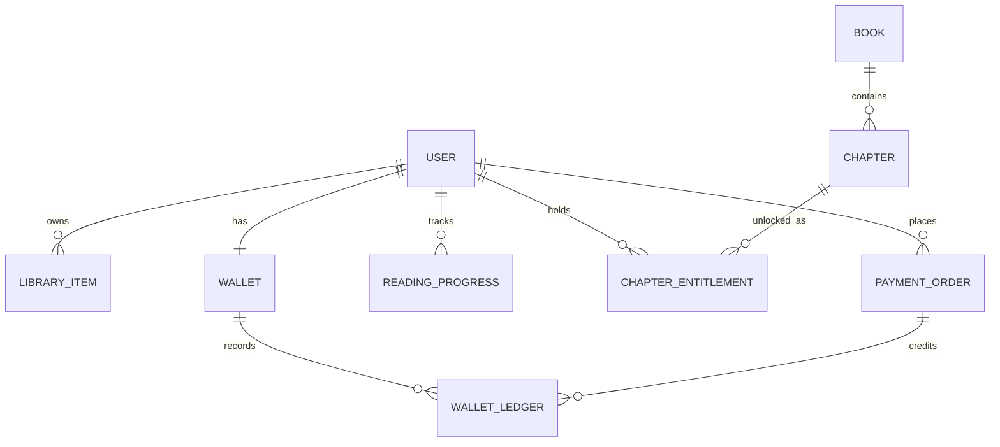
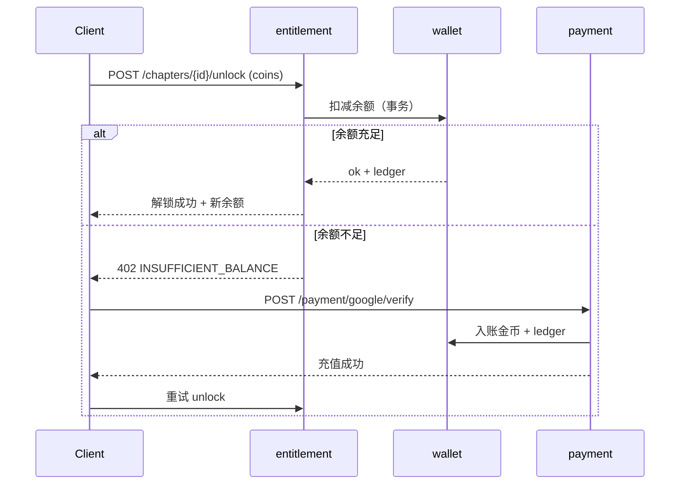

# 后端 API 与数据模型

> 依据：`docs/plan/App架构分配与优化.md` 的后端模块边界、`变现模型.md` 的解锁与钱包机制。
> 目的：把模块边界细化为可实现的接口契约与表结构，覆盖 MVP 主链路。范围限定 MVP（Must）。

## 1. 通用约定

- 风格：REST + JSON，`/api/v1` 前缀。
- 鉴权：登录后下发 JWT，`Authorization: Bearer <token>`；游客也发短期匿名 token。
- 时间：ISO 8601 UTC。金额/金币：整数（金币为整数，货币金额以最小单位分计）。
- 分页：`?page=&size=`，响应含 `{ items, page, size, total }`。
- 错误：HTTP 状态码 + `{ code, message }`，业务错误用稳定 `code`（如 `INSUFFICIENT_BALANCE`）。
- 幂等：解锁、支付回调、广告发奖等写操作支持 `Idempotency-Key`。

## 2. 模块与接口

### 2.1 identity（账号）

| 方法 | 路径 | 说明 |
|---|---|---|
| POST | `/auth/guest` | 创建游客身份，返回匿名 token |
| POST | `/auth/email/register` | 邮箱注册 |
| POST | `/auth/email/login` | 邮箱登录 |
| POST | `/auth/oauth` | Google/Facebook 登录（body: `provider`, `id_token`） |
| POST | `/auth/upgrade` | 游客绑定为正式账号（合并数据） |
| GET | `/me` | 获取当前用户资料 |
| PATCH | `/me` | 更新昵称/头像/语言 |
| POST | `/me/delete` | 发起账号注销（合规要求） |

### 2.2 content + discovery（内容与发现）

| 方法 | 路径 | 说明 |
|---|---|---|
| GET | `/home` | 首页运营位 + 模块化 feed |
| GET | `/genres` | 分类列表 |
| GET | `/genres/{id}/books` | 分类下书籍 |
| GET | `/ranks/{type}` | 榜单（hot/new/finished） |
| GET | `/search?q=` | 搜索书籍 |
| GET | `/books/{id}` | 书籍详情 |
| GET | `/books/{id}/chapters` | 章节列表（含锁状态） |
| GET | `/books/{id}/recommend` | 相似推荐 |

### 2.3 reader（阅读）

| 方法 | 路径 | 说明 |
|---|---|---|
| GET | `/chapters/{id}/content` | 获取章节正文（需通过 entitlement 校验） |
| GET | `/me/library` | 我的书架 |
| POST | `/me/library` | 加入书架（body: `book_id`） |
| GET | `/me/progress/{book_id}` | 读取阅读进度 |
| PUT | `/me/progress/{book_id}` | 上报/同步阅读进度 |

### 2.4 entitlement（解锁权益）

| 方法 | 路径 | 说明 |
|---|---|---|
| GET | `/books/{id}/entitlements` | 该书已解锁章节与免费章范围 |
| POST | `/chapters/{id}/unlock` | 解锁章节，body: `method`（coins/ad/wait），幂等 |
| POST | `/chapters/{id}/wait-unlock` | 启动等待解锁，返回 `ready_at` |
| GET | `/me/wait-unlocks` | 进行中的等待解锁列表 |

> 解锁判定在后端完成，客户端不可自行判定"已解锁"。`unlock` 返回最新余额与权益。

### 2.5 wallet + payment + ads（钱包/支付/广告）

| 方法 | 路径 | 说明 |
|---|---|---|
| GET | `/me/wallet` | 余额（coins + bonus） |
| GET | `/me/wallet/ledger` | 流水分页 |
| GET | `/recharge/packages` | 充值档位（本地化定价） |
| POST | `/payment/google/verify` | Google Billing 验单回调，幂等，发币入账 |
| POST | `/ads/reward` | 激励广告完成校验后发奖，幂等 |
| POST | `/me/checkin` | 每日签到领币 |

### 2.6 growth（增长）

| 方法 | 路径 | 说明 |
|---|---|---|
| POST | `/me/push-token` | 上报 FCM token |
| GET | `/me/messages` | 站内信列表 |
| PATCH | `/me/messages/{id}` | 标记已读 |

## 3. 核心数据模型

### 表定义（MVP 字段）

**user**
| 字段 | 类型 | 说明 |
|---|---|---|
| id | uuid | 主键 |
| type | enum | guest / registered |
| email | string? | 注册邮箱 |
| oauth_provider | enum? | google/facebook |
| nickname / avatar_url | string | 资料 |
| locale | string | 语言偏好 |
| created_at / deleted_at | timestamp | 注销软删除 |

**book**
| 字段 | 类型 | 说明 |
|---|---|---|
| id | uuid | 主键 |
| title / author / cover_url / intro | - | 基本信息 |
| genre / tags | - | 品类与标签 |
| status | enum | ongoing / finished |
| age_rating | enum | general / mature（合规分级） |
| free_chapter_count | int | 免费章数 |
| stats | json | 评分/阅读数等 |

**chapter**
| 字段 | 类型 | 说明 |
|---|---|---|
| id | uuid | 主键 |
| book_id | uuid | 外键 |
| index | int | 章序 |
| title | string | 标题 |
| content_ref | string | 正文存储引用 |
| price_coins | int | 解锁价格（0 = 免费） |

**chapter_entitlement**
| 字段 | 类型 | 说明 |
|---|---|---|
| id | uuid | 主键 |
| user_id / chapter_id | uuid | 唯一组合 |
| method | enum | coins / ad / wait |
| created_at | timestamp | 解锁时间 |

**wallet / wallet_ledger**
| 字段 | 类型 | 说明 |
|---|---|---|
| wallet.user_id | uuid | 主键 |
| wallet.coins / bonus | int | 充值币 / 奖励币 |
| ledger.id | uuid | 流水主键 |
| ledger.type | enum | recharge/unlock/reward/checkin/refund |
| ledger.amount | int | 正为入账，负为支出 |
| ledger.ref_id | string | 关联订单/章节/广告 |
| ledger.balance_after | int | 入账后余额（对账用） |

**payment_order**
| 字段 | 类型 | 说明 |
|---|---|---|
| id | uuid | 主键 |
| user_id | uuid | 下单用户 |
| sku / price / currency | - | 商品与本地化价格 |
| coins / bonus | int | 到账金币 |
| provider | enum | google / apple |
| provider_token | string | 验单凭据 |
| status | enum | pending/paid/failed/refunded |
| is_first_purchase | bool | 首充标记 |

**reading_progress**
| 字段 | 类型 | 说明 |
|---|---|---|
| user_id / book_id | uuid | 唯一组合 |
| chapter_id / offset | - | 续读定位 |
| updated_at | timestamp | 同步时间 |

## 4. 关键流程（解锁 + 充值）

## 5. MVP 不含（与路线图一致）

社区/评论、作者 UGC、漫画/有声、订阅会员、批量订购、Gems 二级货币相关接口与表，均在 MVP 之后再设计。
